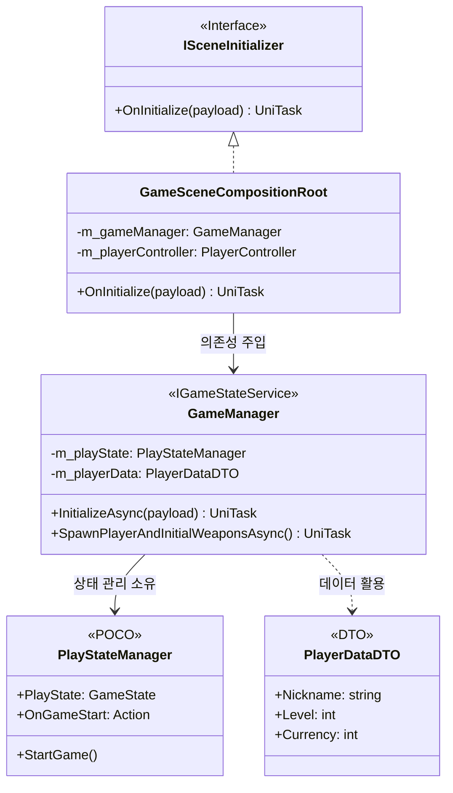
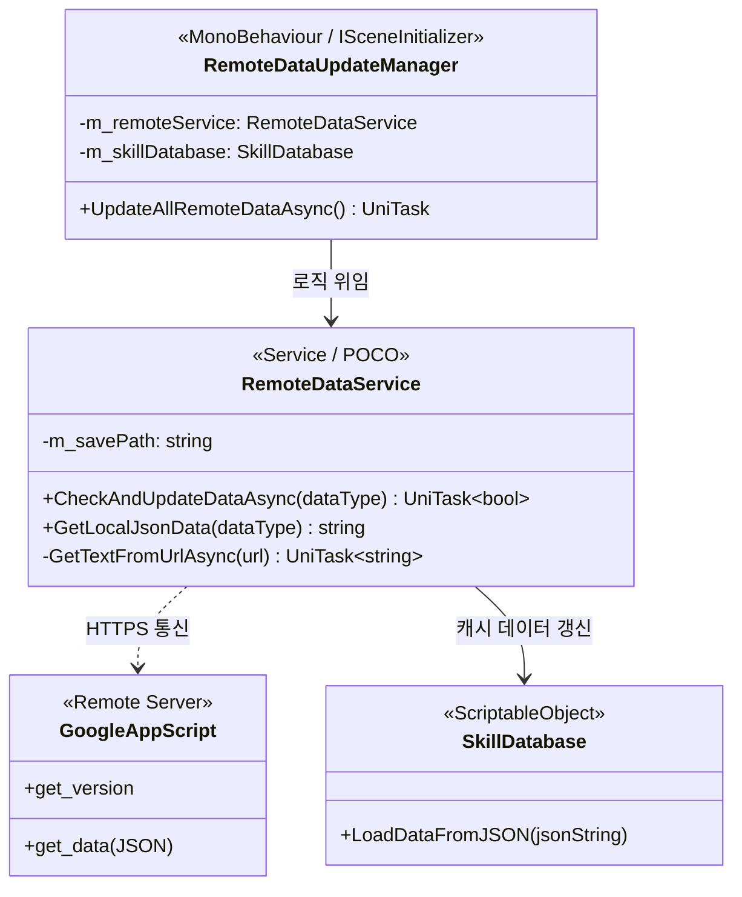

<div align="center">

  # 🚀 모바일 로그라이크 RPG: Project "DogGunhee_Travel"
  
  **수많은 적들과의 대규모 전투 속에서도 안정적인 라이브 서비스를 제공하는 모바일 게임**
  
</div>

<br>

## 🎯 프로젝트 목표
본 프로젝트는 다음 세 가지 목표로 설계되었습니다.
- **유연한 라이브 서비스:** 스토어 업데이트 없이 콘텐츠를 추가하고 관리할 수 있는 환경 구축.
- **최적화된 런타임 성능:** 수많은 오브젝트가 등장하는 대규모 전투에서도 안정적인 프레임 확보.
- **안전한 데이터 관리:** 사용자의 게임 데이터를 위변조로부터 안전하게 보호하고 영속성을 보장.

---

## 🛠️ 주요 기술 스택 (Tech Stack)

| Category | Technology | Description |
| :--- | :--- | :--- |
| **Engine** | **Unity 6 (6000.0.x)** | 최신 롱텀 지원(LTS) 버전 사용 |
| **Language** | **C# 12.0** | 최신 문법 및 고성능 연산 활용 |
| **Async** | **UniTask** | 가비지 없는 비동기 처리 및 로딩 파이프라인 |
| **Asset** | **Addressables** | 원격 리소스 관리 및 동적 패치 시스템 |
| **UI** | **MVVM Pattern** | Logic과 View의 완벽한 분리 및 데이터 바인딩 |
| **VFX** | **DOTween** | 고성능 트윈 애니메이션 및 연출 제어 |
| **Backend** | **TheBackend (뒤끝)** | 서버 세션 관리 및 실시간 데이터 동기화 |
| **Persistence** | **AES-256 + RSA** | 하이브리드 암호화 및 무결성 검증 |

---

## 🏗️ 아키텍처 설계 (Architecture Design)

본 프로젝트는 계층형 아키텍처 (Layered Architecture)와 의존성 주입 (Dependency Injection)을 기반으로 합니다. 씬 조립 계층(Composition Root)을 통해 객체간 결합도를 낮췄습니다.

### 🧩 시스템 클래스 다이어그램



### 1. 의존성 조립 및 씬 진입 (Composition Root)
`GameSceneCompositionRoot`는 씬 로드 시 `ScenePayloadDTO`를 통해 전달받은 데이터를 각 시스템(`GameManager`, `UIManager` 등)에 명시적으로 주입합니다.
### 2. 비동기 에셋 로딩 파이프라인
Addressables와 UniTask를 결합하여 런타임 중에도 프리징 없는 리소스를 생성합니다.
### 3. 구글 스프레드시트 (GAS) 기반 리모트 데이터 동기화
전용 백엔드 서버 대신 **Google App Script (GAS)**와 스프레드시트를 파싱하여 기획 데이터를 원격으로 동기화하는 시스템을 구축했습니다.

**아키텍처 핵심:**
- **버전 캐싱 (Version Caching):** 실행 시 로컬의 버전 파일(`_version.txt`)과 서버의 버전을 대조하여, 업데이트가 있을 때만 데이터를 받아옵니다.
- **오프라인 폴백 (Offline Fallback):** 네트워크 문제가 발생해도 로컬에 저장된 마지막 버전의 JSON 캐시를 즉기 로드하여 게임 플레이를 보장합니다.

#### 🔀 리모트 데이터 동기화 파이프라인 (Mermaid)




---

## 📂 프로젝트 폴더 구조

```
Assets/_Game/Scripts/
├── 00_Core/           # 추상화 계층 (Interfaces, DI Root, Common Context)
├── 01_Infrastructure/ # 외부 서비스 연동 (Network, Remote Services, Log)
├── 02_Domain/         # 비즈니스 데이터 모델 (DTOs, POCO Classes)
├── 03_Data/           # 데이터 저장 및 조회 (Repositories, Databases)
├── 04_Managers/       # 전역 시스템 관리 (AppUpdate, RemoteDataUpdate)
├── 05_Presentation/   # UI 및 인게임 구현 (MVVM, Views, ViewModels, Entities)
└── 99_Shared/         # 프로젝트 전역 유틸리티 및 상수
```

---

## 📂 프로젝트 구조 (구 시스템 설명)

### 🗂️ Assets/Game_Resource (리소스)
```
Assets/Game_Resource/
├── Common/              # 공통 리소스 (대부분의 게임 에셋 통합)
├── IntroScene/          # 인트로 씬 전용 리소스
├── LobbyScene/          # 로비 씬 전용 리소스
└── LoadResourceScene/   # 로딩 씬 리소스
```

### 📜 Assets/Scripts (스크립트)
```
Assets/Scripts/
├── Data/                # 데이터 모델 및 관리
├── Editor/              # 에디터 확장 스크립트
├── InGame/              # 인게임 로직 (Player, Mob, Manager 등 핵심 코어)
│   ├── Drop_Item/       # 아이템 드롭 로직
│   ├── Manager/         # GameManager, EffectManager, UIManager 등
│   ├── Mob/             # 몬스터 AI 및 행동 로직
│   ├── ObjectPool/      # 최적화를 위한 풀링 시스템
│   ├── Player/          # 플레이어 컨트롤 및 스탯 관리
│   └── Weapon/          # 무기 및 투사체 구현 (Weapon)
├── Lobby/               # 로비 씬 로직 및 UI
├── Manager/             # 전역 관리 매니저 (SceneLoader 등)
├── protect/             # 보안 및 암호화 (HybridEncryption)
├── ScriptableOJB/       # 스크립터블 오브젝트 데이터
├── Test/                # 테스트용 스크립트
└── Title/               # 타이틀 화면 로직 (MVVM 패턴 적용)
```
